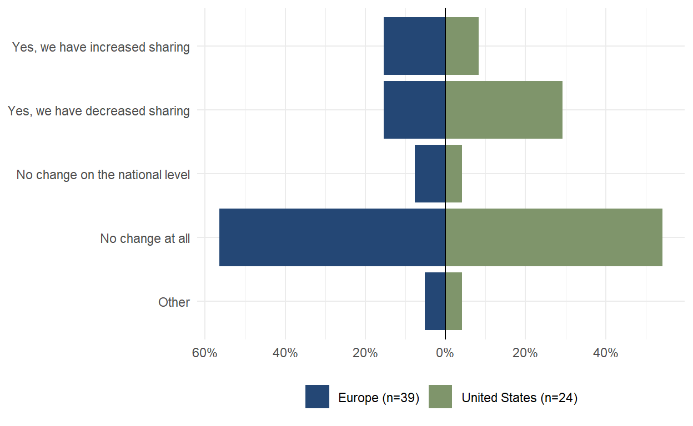

+++
title="Wave 6 Findings"
weight=2
extra.footer_nav=true
extra.sub_nav =["Introduction", "Data Collection", "Findings", "Conclusions"]
+++


placeholder




    <!-- Left vertical line -->
    

        <!-- Full report section -->
        

            <a class="text font-bold" style="text-decoration: none;">
                Full report:
            </a>
        

        

            
                <svg width="14" height="14" viewBox="0 0 14 14" fill="none" xmlns="http://www.w3.org/2000/svg">
                    <path d="M14 9.52655H11.2609V2.76181H4.43671V0H14V9.52655Z" fill="#071A2D"/>
                    <path d="M11.5818 0.368914L-0.000976562 12.0476L1.93586 14.0005L13.5186 2.32179L11.5818 0.368914Z" fill="#071A2D"/>
                </svg>
            
            <a href="https://github.com/FelixHenninger/tapp/blob/main/content/findings/wave6/w6_white_paper.pdf" download class="text-blue-500">
                Download here (PDF)
            </a>
        

          
        <!-- Citation section -->
        <a class="text font-bold" style="text-decoration: none;">
            Citation:
        </a>
        

            
                <svg width="14" height="14" viewBox="0 0 14 14" fill="none" xmlns="http://www.w3.org/2000/svg">
                    <path d="M14 9.52655H11.2609V2.76181H4.43671V0H14V9.52655Z" fill="#071A2D"/>
                    <path d="M11.5818 0.368914L-0.000976562 12.0476L1.93586 14.0005L13.5186 2.32179L11.5818 0.368914Z" fill="#071A2D"/>
                </svg>
            
            Citation: Shilton, K., Kreider, A., Mukhopadhyay, S. & TAPP Team. (2024). Transatlantic
            Privacy Perception (TAPP)
            Panel, Wave 6 White paper.   [June 2025].
        

    





During a period of increasing data governance regulation in the US and the EU, how have organizational
data governance practices changed? And how do privacy experts see their own role in making those
changes? This white paper reports on survey results from a panel of North American and European
privacy experts. It finds that privacy experts believe data governance is changing both organizationally
and nationally, with increasing challenges accessing data in the United States. But while this change is
happening, privacy experts report having influence within their organizations (particularly within the
EU), but not on their national governments. And these experts worry about both misuses of data, and
the impact of restrictions on data flows.



{{ anchor(title="Introduction")}}


This paper builds on the Transatlantic Privacy Perceptions (TAPP), a survey panel which collects data
from privacy policy experts and practitioners across the USA and Europe, representing diverse sectors
such as academia, technology industry, non-technology industry, government, law, journalism,
non-profit and non-governmental organizations, and think tanks (Kreuter et al., 2023). The TAPP panel
differs from other surveys by systematically gathering insights from a diverse cohort of privacy experts,
spanning multiple industries and countries and whose expertise provides practical perspectives on
regulatory implementation, enforcement and effectiveness.

**2.1 Panel sample composition** The target population for the TAPP Panel is self-identified privacy policy experts with expertise in
countries located on both sides of the Atlantic. The sample constitutes a purposive sample, indicating
that participants were selected based on their expertise rather than randomly. Given our sampling
strategy and the significant difficulty in recruiting digital privacy experts to participate, conclusions
should not be extrapolated to the entire population of privacy experts. All results shown in this paper
and on the TAPP website and reports are descriptive statistics obtained from the panel's respondents
and are not intended to be generalizable to the whole population.

**2.3 Data collection** The most recent wave of data collection, reported here, is Wave 6. The Wave 6 questionnaire asked
respondents about their perceptions of changes in data sharing and access processes and policies,
particularly in response to the growing implementation of AI (see Section 3 for specific questions and
findings). Wave 6 fielding initially ran from 5 February to 5 March 2025, but was extended from 28 March
to 22 May 2025 to allow for promotion at related events. Respondents comprised both invited panel
2
members (n = 94) as well as individuals recruited via links shared on social media and in relevant
newsletters (n = 41) for a total of 105 partial or complete responses (AAPOR 1.1 or 1.2).



{{ anchor(title="Data Collection")}}


Key takeaways: data governance and accessibility of both government and proprietary data have
changed markedly in the last 1-2 years, due to changes in both technology and national policies, and
particularly in the United States. On the whole, European experts report that data sharing and access in
their countries have remained relatively stable and are more positive about the effects of national data
governance policies on their work. A significant minority of American experts, responding to shifting
data policies and priorities of the Trump administration, report decreased sharing and greater difficulty
in accessing data, particularly government data. Large majorities also report that these changing
policies have negatively affected their work.

European experts also express greater influence in their organizations' data and AI policies than
Americans do. Finally, all experts report concern that bad actors could use data to manipulate the
general public.

**3.1 Data protection** Data governance is a moving target. A majority of participants in both the US and EU report that their
organization has changed how it protects data in the past 1-2 years.

*In the last 1-2 years, has your organization changed how it protects data? (org_protect)*

    
    
Figure 1. Percentage of organizations that changed their data protection in the last 1-2 years

**3.2 Changes in sharing data** 

*In the last 1-2 years, has your organization changed the way it shares data with other organizations
nationally? (org_sharing and org_sharing_natl combined)*

    
    
Figure 2. Perception of organizational change in national data sharing in the last 1-2 years



{{ anchor(title="Findings")}}

**3.1 Respondents Profile**
Wave 5 of the TAPP survey received responses from 66 participants. In terms of professional background, 35% are from academia, and 14 % are from the tech industry while 14 % are from the private sector, but from non-tech industry (Figure 1). 

    
    
Figure 1. Respondents composition by sector

Notably, 52% of respondents have worked in the privacy field for more than 10 years (Figure 2), and only 3% less than a year. The sample includes 44 participants with more knowledge about the European privacy context and 22 of the American context.

    
    
Figure 2. Respondents composition by years of experience with privacy

**3.2 Balance of interest in digital privacy laws**

The comparison of interest in digital privacy laws reveals relevant regional differences. In Europe, there's a notable shift towards favoring individual users over businesses. From 2023 to 2024, the percentage of respondents believing laws favor individual users rose from 44% to 75%. Conversely, in the United States (USA), the perception that laws favor businesses remains overwhelmingly high, with 92% in 2023 and 86% in 2024. This underscores the divergent approach to privacy laws on either side of the Atlantic, with Europe moving towards greater protection for individuals while the USA maintains a business-friendly stance (Figure 3).

    
    
Figure 3. Balance of interest in digital privacy laws

**3.3 Influence of laws on development of privacy-preserving practices and technologies**

This analysis highlights a growing perception in the USA that privacy laws are encouraging innovation in privacy-preserving technologies (Figure 4). The percentage of respondents in the USA who believe laws encourage innovation almost doubled, from 27% in 2023 to 50% in 2024. On the other hand, Europe shows a slight decline in this belief, dropping from 49% in 2023 to 41% in 2024. However, this difference primarily leaned towards neutrality, increasing from 23% to 36%, rather than discouragement, which decreased from 28% to 23%. This trend indicates a positive shift in the USA towards recognizing the benefits of privacy laws in fostering technological innovation, while Europe maintains a more balanced view.

    
    
Figure 4. Influence of laws on development of privacy-preserving practices and technologies

**3.4 Comprehensiveness of digital privacy laws**

There is a notable difference between stakeholders in Europe and the USA regarding whether digital privacy laws cover the necessary areas (Figure 5). In Europe, 55% in 2022, 57% in 2023 and 43% in 2024 felt the laws cover fewer areas than needed. In the USA, 100% of respondents in 2022, 94% in 2023 and 95% in 2024 felt that the laws cover fewer areas than required, suggesting a broader dissatisfaction in the US about the comprehensiveness of these laws.

    
    
Figure 5. Comprehensiveness of digital privacy laws

**3.5 Enforcement of digital privacy practices**

The enforcement of digital privacy practices presents an interesting contrast between Europe and the USA (Figure 6). In Europe, there's a noticeable increase in the belief that privacy practices are "Mostly" enforced, rising from 9% in October 2022 to 27% in August 2024. Meanwhile, in the USA, perceptions remain more stable with a slight increase in minimal enforcement, suggesting that privacy practices are "A little" enforced. This contrast highlights the varying levels of regulatory enforcement and public perception, with Europe moving towards stronger enforcement and the USA showing more mixed views.

    
    
Figure 6. Enforcement of digital privacy practices

**3.6 Current and future outlook of digital privacy laws**

Respondents generally perceive EU digital privacy laws more favorably compared to those in the USA. Figure 7 shows that the percentage of respondents rating the current state of EU digital privacy laws as good or excellent increased from 48% to 59% over the past year. Conversely, while 100% of respondents classified the USA's digital privacy laws as poor or fair in 2023, this figure decreased to 91% in 2024, with 9% now evaluating them as good or excellent.

When considering the future, optimism about the EU's digital privacy trajectory declined, with the percentage of optimistic respondents dropping from 49% to 36%. Opinions about the USA's future regulations remain divided, with 41% of respondents still expressing pessimism and 45% expressing optimism.

    
    
Figure 7. Enforcement of digital privacy practices

**3.7 Policy making approaches in digital privacy protection**

The pessimistic evaluation of privacy laws in the USA might be attributed to its fragmented privacy framework. As Figure 8 shows, 64% of respondents believe that digital privacy policy in the US should be established at the federal level, while 36% think it should be at both the state and federal levels. None of the respondents believe it should be determined solely at the state level, which reflects the current situation. In Europe, 3% of respondents think that privacy laws should be made exclusively at the EU member-state level, while 56% support an EU-level approach only and 41% favor a combination of both levels.

    
    
Figure 8. Policymaking approaches in digital privacy protection

**3.8 Current and future outlook of organizational digital privacy practices**

Regarding the overall assessment of organizations' digital privacy policies and practices (Figure 9), the current state remains negative, especially in the USA, where 95% of respondents rated it as poor or fair in 2024, compared to 91% in 2023. In Europe, 75% and 76% of respondents evaluated it negatively in 2024 and 2023, respectively.

The future outlook for organizational digital privacy is more optimistic in Europe than in the USA, though it declined from 2023 to 2024: in 2023, 55% of respondents viewed it as somewhat or very optimistic, but this dropped to 32% in 2024. Many respondents shifted to a neutral stance, with those indicating “neither” increasing from 17% to 41%. In the USA, the future outlook remains pessimistic, with 57% of respondents being very or somewhat pessimistic in 2023 and 55% in 2024, and those seeing it as somewhat or very optimistic decreased from 31% to 18%.

    
    
Figure 9. Current and future outlook of organizational digital privacy practices

**3.9 Stakeholder ratings of organizations’ privacy protection performance**

Regardless of region, public organizations such as country statistical agencies, tax authority and social security authority are better evaluated according to their privacy protection performance than private organizations, which include Meta, Google, Amazon, Visa, Mastercard, Apple, and Microsoft. 24% of the respondents for the USA and 18% for Europe evaluate the privacy protection performance of public institutions as excellent (Figure 10). On the other hand, 45% of the respondents from Europe and 34% from the USA evaluate the privacy protection performance of private organizations as poor.  For detailed analysis for specific organizations we refer to our dynamic data visualization tool at <a href="https://privacyperceptions.org/results/">https://privacyperceptions.org/results/</a>

    
    
Figure 10. Organizations privacy protection performance ratings

**3.10 Most important approach in protecting people’s digital privacy**

In Wave 5, "enforcing rules about how data is processed, stored, and shared" emerged as the most crucial approach to protecting individuals' digital privacy for Europeans(Figure 11), with the highest percentage of respondents ranking it as their top priority (30%). However, in Wave 2, this focus on enforcement dropped to fifth place (16%, Figure 13), with the emphasis shifting to "designing and deploying privacy-preserving technology" as the primary priority (27%).
In 2024, “regulating how data is processed, stored, and shared” was generally a lower priority, with 35% of respondents ranking it as least important (rank number 5) while in 2023, "giving individuals control over their data" was the least important with 34% of respondents ranking it as 5.
Interestingly, in 2024, 36% of privacy experts in the USA stated that "giving individuals control over their data" is both the most important and least important aspect (Figure 12). While “giving individuals control over their data" was the least important approach in protecting people’s digital privacy in 2023 (47%, Figure 14), the most important were “designing and deploying privacy-preserving technology” and “regulating data processing, storage and sharing” with 29% of the respondents ranking them as number 1.
Regional preferences also varied: in 2024, USA experts placed a higher emphasis on data control, with 36% ranking it as their top priority compared to 12% of European experts. Conversely, European experts favored technology-based solutions, with 28% ranking it number one compared to only 9% of USA experts. Processing regulations ranked consistently low for both groups, with more European experts (35%) than USA experts (23%) designating it as the lowest priority (number 5).

    
    
Figure 11. Wave 5 (September 2024) Ranking of Approaches to Protecting People's Digital Privacy in Europe

    
    
Figure 12. Wave 5 (September 2024) Ranking of Approaches to Protecting People's Digital Privacy in the USA

    
    
Figure 13. Wave 2 (August 2023) Ranking of Approaches to Protecting People's Digital Privacy in Europe

    
    
Figure 14. Wave 2 (August 2023) Ranking of Approaches to Protecting People's Digital Privacy in the USA

**3.11 Impact of the EU AI Act on AI innovation**

Proposed by the European Unit, the EU AI Act <a href="https://artificialintelligenceact.eu/">EU AI Act</a> is the world’s first comprehensive attempt to regulate AI at establishing guidelines and restrictions on the development, deployment, and use of artificial intelligence within the EU.

The results indicate varied perceptions between Europe and the USA on the EU AI Act's impact on innovation. In Europe, opinions are relatively balanced, with 36% believing it will neither enable nor hinder AI innovation, while 30% feel it may hinder innovation, and 18% think it will enable it. In contrast, the USA shows a stronger inclination towards skepticism, with 41% of respondents suggesting the Act is more likely to hinder innovation, and only 5% seeing it as potentially enabling. Additionally, a notable 23% in the USA and 16% in Europe responded with "don't know," reflecting some uncertainty in both regions regarding the Act's potential outcomes. This contrast highlights regional differences in attitudes towards regulatory impacts on AI progress.

    
    
Figure 15. Impact of the European Artificial Intelligence Act on AI innovation



{{ anchor(title="Conclusions")}}


The fifth wave of the Transatlantic Privacy Perceptions (TAPP) panel survey highlights significant insights into the current state of digital privacy laws and practices between the USA and Europe. According to the survey, European privacy laws are increasingly seen as favoring individual users, while in the USA, privacy laws are largely perceived as favoring businesses. This divergence underscores the differing approaches to privacy regulation on either side of the Atlantic. In the USA, there is a growing perception that privacy laws encourage innovation, reflecting a positive shift towards recognizing the benefits of privacy regulations in fostering technological advancements. In contrast, this perception has slightly declined in Europe, indicating a more balanced view. European privacy laws continue to receive more favorable perceptions from the TAPP panelists, although optimism about future advancements has declined. On the other hand, negative views on current privacy laws persist in the USA, but there is a slight increase in optimism about future improvements. This suggests a cautious yet hopeful outlook towards the evolution of privacy regulations.
The survey indicates that enforcing rules on data processing, storage, and sharing is the top priority for protecting digital privacy in Europe. By comparison, USA experts prioritize giving individuals control over their data. European experts, however, favored technology-based solutions. Processing regulations ranked consistently low for both groups, with more European experts than USA experts designating it as the lowest priority. These findings highlight regional preferences and evolving priorities to develop more effective and comprehensive digital privacy strategies.



