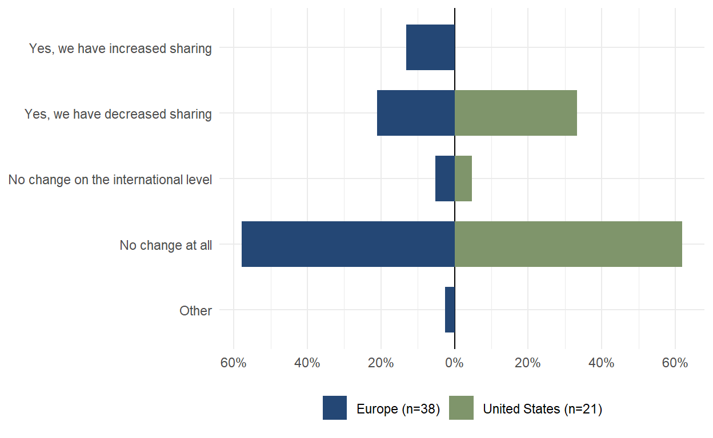
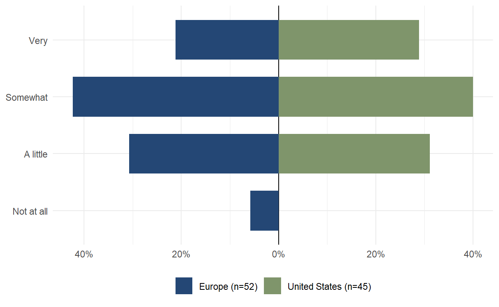

+++
title="Wave 6 Findings"
weight=2
extra.footer_nav=true
extra.sub_nav =["Introduction", "Data Collection", "Findings", "Conclusions"]
+++


placeholder




    <!-- Left vertical line -->
    

        <!-- Full report section -->
        

            <a class="text font-bold" style="text-decoration: none;">
                Full report:
            </a>
        

        

            
                <svg width="14" height="14" viewBox="0 0 14 14" fill="none" xmlns="http://www.w3.org/2000/svg">
                    <path d="M14 9.52655H11.2609V2.76181H4.43671V0H14V9.52655Z" fill="#071A2D"/>
                    <path d="M11.5818 0.368914L-0.000976562 12.0476L1.93586 14.0005L13.5186 2.32179L11.5818 0.368914Z" fill="#071A2D"/>
                </svg>
            
            <a href="w6_white_paper.pdf" download class="download-link">
                Download here (PDF)
            </a>
        

          
        <!-- Citation section -->
        <a class="text font-bold" style="text-decoration: none;">
            Citation:
        </a>
        

            
                <svg width="14" height="14" viewBox="0 0 14 14" fill="none" xmlns="http://www.w3.org/2000/svg">
                    <path d="M14 9.52655H11.2609V2.76181H4.43671V0H14V9.52655Z" fill="#071A2D"/>
                    <path d="M11.5818 0.368914L-0.000976562 12.0476L1.93586 14.0005L13.5186 2.32179L11.5818 0.368914Z" fill="#071A2D"/>
                </svg>
            
            Citation: Shilton, K., Kreider, A., Mukhopadhyay, S. & TAPP Team. (2024). Transatlantic
            Privacy Perception (TAPP)
            Panel, Wave 6 White paper.   [June 2025].
        

    





During a period of increasing data governance regulation in the US and the EU, how have organizational
data governance practices changed? And how do privacy experts see their own role in making those
changes? This white paper reports on survey results from a panel of North American and European
privacy experts. It finds that privacy experts believe data governance is changing both organizationally
and nationally, with increasing challenges accessing data in the United States. But while this change is
happening, privacy experts report having influence within their organizations (particularly within the
EU), but not on their national governments. And these experts worry about both misuses of data, and
the impact of restrictions on data flows.



{{ anchor(title="Introduction")}}


This paper builds on the Transatlantic Privacy Perceptions (TAPP), a survey panel which collects data
from privacy policy experts and practitioners across the USA and Europe, representing diverse sectors
such as academia, technology industry, non-technology industry, government, law, journalism,
non-profit and non-governmental organizations, and think tanks (Kreuter et al., 2023). The TAPP panel
differs from other surveys by systematically gathering insights from a diverse cohort of privacy experts,
spanning multiple industries and countries and whose expertise provides practical perspectives on
regulatory implementation, enforcement and effectiveness.

**2.1 Panel Sample Composition** The target population for the TAPP Panel is self-identified privacy policy experts with expertise in
countries located on both sides of the Atlantic. The sample constitutes a purposive sample, indicating
that participants were selected based on their expertise rather than randomly. Given our sampling
strategy and the significant difficulty in recruiting digital privacy experts to participate, conclusions
should not be extrapolated to the entire population of privacy experts. All results shown in this paper
and on the TAPP website and reports are descriptive statistics obtained from the panel's respondents
and are not intended to be generalizable to the whole population.

**2.3 Data Collection** The most recent wave of data collection, reported here, is Wave 6. The Wave 6 questionnaire asked
respondents about their perceptions of changes in data sharing and access processes and policies,
particularly in response to the growing implementation of AI (see Section 3 for specific questions and
findings). Wave 6 fielding initially ran from 5 February to 5 March 2025, but was extended from 28 March
to 22 May 2025 to allow for promotion at related events. Respondents comprised both invited panel
2
members (n = 94) as well as individuals recruited via links shared on social media and in relevant
newsletters (n = 41) for a total of 105 partial or complete responses (AAPOR 1.1 or 1.2).



{{ anchor(title="Data Collection")}}


Key takeaways: data governance and accessibility of both government and proprietary data have
changed markedly in the last 1-2 years, due to changes in both technology and national policies, and
particularly in the United States. On the whole, European experts report that data sharing and access in
their countries have remained relatively stable and are more positive about the effects of national data
governance policies on their work. A significant minority of American experts, responding to shifting
data policies and priorities of the Trump administration, report decreased sharing and greater difficulty
in accessing data, particularly government data. Large majorities also report that these changing
policies have negatively affected their work.

European experts also express greater influence in their organizations' data and AI policies than
Americans do. Finally, all experts report concern that bad actors could use data to manipulate the
general public.

**3.1 Data Protection** Data governance is a moving target. A majority of participants in both the US and EU report that their
organization has changed how it protects data in the past 1-2 years.

*In the last 1-2 years, has your organization changed how it protects data? (org_protect)*

    
    
Figure 1. Percentage of organizations that changed their data protection in the last 1-2 years

**3.2 Changes in Sharing Data** 

*In the last 1-2 years, has your organization changed the way it shares data with other organizations
nationally? (org_sharing and org_sharing_natl combined)*

    
    
Figure 2. Perception of organizational change in national data sharing in the last 1-2 years

*n the last 1-2 years, has your organization changed the way it shares data with other organizations
internationally? (org_sharing and org_sharing_intl combined)*

    
    
Figure 3. Perception of organizational change in international data sharing in the last 1-2 years

Data sharing, on the other hand, remains largely unchanged on the whole, with a majority of both
European and US respondents reporting no change at all in the way their organizations share data
nationally or internationally. However, a significant minority of American respondents reported
decreased data sharing in the last 1-2 years.

**3.3 Data Access**

*Overall, in the last 1-2 years, have policy changes in [the US / the EU / country] made accessing
government data / proprietary data easier, harder, or stayed the same? (access_gov and access_prop)*

    
    
Table 1. Perception of the influence of policy changes in the last 1-2 years on accessing government and proprietary data

During the period of our survey, the United States was undergoing a crisis of access to government data
after a change in administration, and that was reflected in our survey. 60% of US respondents indicated
that it was becoming harder to access government data. 50% of US respondents were also concerned
about access to proprietary or industry data.

**3.4 Influence at Organizational Level**

*Do you feel you have influence in the development of data policies at organizational level?
(data_influence_org)*

    
    
Figure 4. Perception of personal influence in the development of data policies at organizational level

*Do you feel you have influence in the development of AI policies at organizational level?
(AI_influence_org)*

    
    
Figure 5. Perception of personal influence in the development of AI policies at organizational level

European respondents are feeling much more confident about their influence within their
organizations. 70% of respondents reported influence on both data and AI policies in their organization.
In contrast, only 35% of US respondents reported influence on data policies, while US respondents
were evenly split on whether they impacted AI policies in their organizations

**3.5 Influence at National Policy Level**

*Do you feel you have influence in the development of data policies at national policy level?
(dat_influence_policy)*

    
    
Figure 6. Perception of personal influence in the development of data policies at national policy level

*Do you feel you have influence in the development of AI policies at national policy level?
(AI_influence_policy)*

    
    
Figure 7. Perception of personal influence in the development of AI policies at national policy level

However, when it came to national data governance policies in both regions, many fewer respondents
felt they had influence. Overwhelming majorities in both regions answered that they did not influence
data or AI policies at the national level.

**3.6 Perceived Manipulation**

*How concerned are you that adversaries or bad actors could use data to manipulate the general public?
(public_manipulation)*

    
    
Figure 8. Concern about manipulation by adversaries or bad actors towards the general public

*How concerned are you that adversaries or bad actors could use data to manipulate people
like you? (self_manipulation)*

    
    
Figure 9. Concern about manipulation by adversaries or bad actors towards oneself

Finally, we asked about perceptions of the possible negative impacts of changing data governance,
including potential misuses of data and negative impacts for work, the economy, and the conduct of
science. A large majority of both European and US respondents worried that data could be used to
manipulate the general public, but many less worried about being manipulated themselves.

**Negative Impact of Policies**

*In your opinion, have state or national policies that restrict data flows had a positive, negative, or
no impact on your work / on the national economy as a whole / on science?
(Neg_restrictions_work, Neg_restrictions_econ, Neg_restrictions_science)*

    
    
Figure 10. Perception of negative impact of state or national policies that restrict data flows

A minority of Europeans were worried about data restrictions impacting their work, their national
economies, or the practice of science. This contrasted with US experts, large majorities of whom
worried that restricted data flows would negatively impact both the national economy and the conduct
of science.


